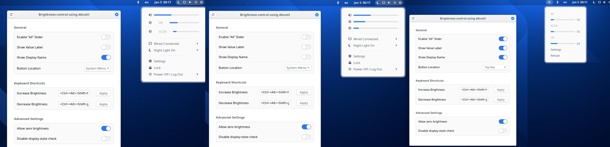

Display Brightness Slider for Gnome Shell



- [Setup ddcutil](#setup-ddcutil)
- [Installation](#installation)
  - [Automatically from GNOME extensions](#automatically-from-gnome-extensions)
  - [Manually from the source code](#manually-from-the-source-code)
- [Issues](#issues)
  - [Screen hangs/locks on first startup](#screen-hangslocks-on-first-startup)
- [Credits](#credits)
    - [Thanks to the following people for contributing via pull requests:](#thanks-to-the-following-people-for-contributing-via-pull-requests)
    - [Thanks to the following extensions for the inspiration](#thanks-to-the-following-extensions-for-the-inspiration)
## Setup ddcutil

1. install `ddcutil`

2. Manually load kernel module `i2c-dev`

```sh

sudo modprobe i2c-dev

```

3. Verify that your monitor supports brightness control

```sh

ddcutil capabilities | grep "Feature: 10"

```

4. udev rule for giving group i2c RW permission on the `/dev/i2c` devices

ddcutil 2.0+
```sh

sudo cp /usr/share/ddcutil/data/60-ddcutil-i2c.rules /etc/udev/rules.d

```
Prior ddcutil 1.4.0
```sh

sudo cp /usr/share/ddcutil/data/45-ddcutil-i2c.rules /etc/udev/rules.d

```

Read more: [https://www.ddcutil.com/i2c_permissions/](https://www.ddcutil.com/i2c_permissions/)


5. Create i2c group and add yourself

```sh

sudo groupadd --system i2c

sudo usermod $USER -aG i2c

```

6. load `i2c-dev` automatically

```sh

sudo touch /etc/modules-load.d/i2c.conf

sudo sh -c 'echo "i2c-dev" >> /etc/modules-load.d/i2c.conf'

```

7. Reboot for changes to take effect

```sh

sudo reboot

```

This tool uses ddcutil as backend, so first make sure that your user can use use following shell commands without root or sudo.

`ddcutil getvcp 10` to check the brightness of a monitor and

`ddcutil setvcp 10 100` to set the brightness to 100

It automatically supports multiple displays detected by

`ddcutil detect`


## Installation

### Automatically from GNOME extensions
You can find this extension [here](https://extensions.gnome.org/extension/2645/brightness-control-using-ddcutil/)

### Manually from the source code
Clone this repo and in the repo's root directory run these shell commands

```sh
make build
make install
```

## Issues

### Screen hangs/locks on first startup
In my hardware for some reason when `ddcutil detect` is ran for the first time after a cold boot and then, when it checks for i2c busno=1, whole system locks for couple of seconds.
As a workaround I changed this extension to read cached info from a file, when it exists.

```sh
ddcutil --brief detect > $XDG_CACHE_HOME/ddcutil_detect
```
## Contributing

[](https://github.com/daitj/gnome-display-brightness-ddcutil/issues?q=is%3Aopen+is%3Aissue+label%3A%22good+first+issue%22) [](https://github.com/daitj/gnome-display-brightness-ddcutil/issues?q=is%3Aopen+is%3Aissue+label%3A%22help+wanted%22) [](https://github.com/daitj/gnome-display-brightness-ddcutil/pulls?q=is%3Aopen+is%3Aissue+label%3A%22help+wanted%22) [](https://github.com/daitj/gnome-display-brightness-ddcutil/issues?q=is%3Aopen)

👋 **Welcome, new contributors!**

Whether you're a seasoned developer or just getting started, your contributions are valuable to us. Don't hesitate to jump in, explore the project, and make an impact. To start contributing, please check out our [Contribution Guidelines](CONTRIBUTING.md). 

## Credits

This extension is developed and maintained by [@daitj](https://github.com/daitj)

#### Thanks to the following people for contributing via pull requests:
- @oscfdezdz for adding new settings UI, keyboard shortcuts and ability to set icon location
- @maniacx for porting the extension to GNOME 45
#### Thanks to the following extensions for the inspiration
- [Night Theme Switcher](https://extensions.gnome.org/extension/2236/night-theme-switcher/) for keyboard shortcut UI.
